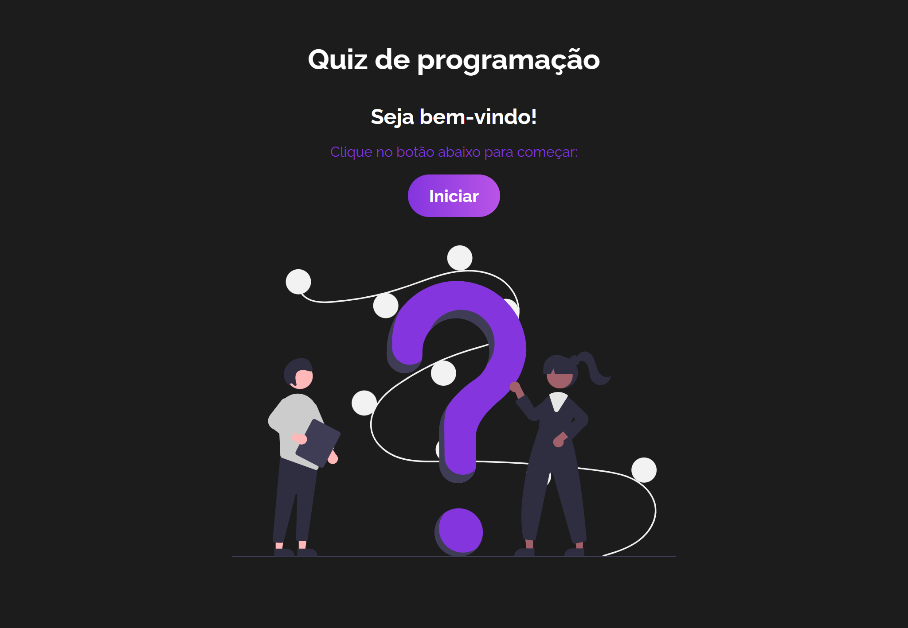
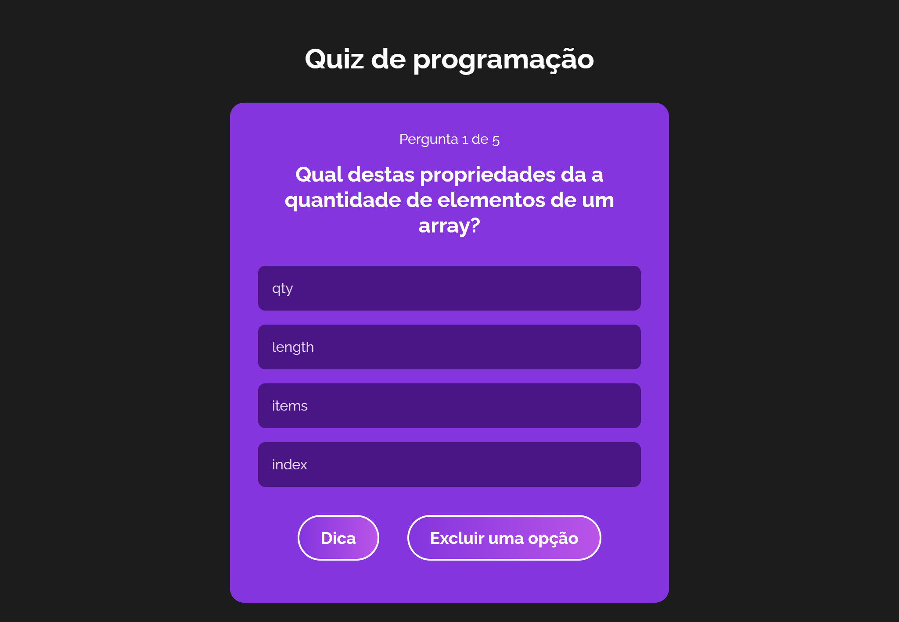

# Projeto Quiz
Este projeto consiste em um <b>Quiz</b> de perguntas e respostas sobre desenvolvimento web, abrangendo categorias como HTML, CSS e JavaScript. O projeto possui as seguintes funcionalidades:
- Apresentação de 5 perguntas por categoria com 4 opções de resposta.
- Permite ao usuário escolher entre receber uma dica sobre a resposta correta ou eliminar uma alternativa de resposta. 
- Feedback imediato sobre a resposta do usuário.
- Pontuação com base nas respostas corretas.
- Finalização do quiz e exibição do resultado.
- Funcionalidade de reiniciar o quiz.

O quiz foi inicialmente inspirado no [tutorial do Matheus Battisti](https://www.youtube.com/watch?v=HlkbeikH8cs), mas foram realizadas algumas modificações para enriquecer a experiência, tais como:
- Adição de ícones para identificar a resposta correta e a opção errada escolhida pelo usuário.
- Implementação do hook customizado 'useQuiz'.
- Inclusão de novas questões e dicas.
  
## 💻 Layout  

  
  

    
## 🔧 Tecnologias

O projeto foi desenvolvido utilizando as seguintes tecnologias:
- Vite
- React JS
- Hooks: useState, useReducer e criação de um hook customizado
- Context API para gerenciamento de estado global

## 🛠️ Como Executar o Projeto

Para jogar, basta [clicar aqui](https://quiz-ochre-eight.vercel.app/). Divirta-se!
